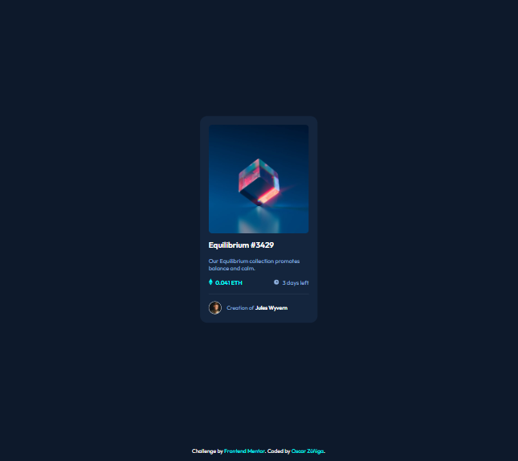

# Frontend Mentor - NFT preview card component solution

This is a solution to the [NFT preview card component challenge on Frontend Mentor](https://www.frontendmentor.io/challenges/nft-preview-card-component-SbdUL_w0U). Frontend Mentor challenges help you improve your coding skills by building realistic projects. 

## Table of contents

- [Overview](#overview)
  - [The challenge](#the-challenge)
  - [Screenshot](#screenshot)
  - [Links](#links)
- [My process](#my-process)
  - [Built with](#built-with)
- [Author](#author)

## Overview

### The challenge

Users should be able to:

- View the optimal layout depending on their device's screen size
- See hover states for interactive elements

### Screenshot

### Links

- Solution URL: [https://github.com/1994oscar/nft-preview-card-component-main-chlg-03](https://github.com/1994oscar/nft-preview-card-component-main-chlg-03)
- Live Site URL: [NFT preview card component challenge](https://www.nft-preview-card-component.xn--oscarziga-q6a2h.com/)

## My process

### Built with

- Semantic HTML5 markup
- Flexbox
- Sass
- Mobile-first workflow

## Author

- Website - [Oscar Zúñiga](https://www.xn--oscarziga-q6a2h.com/)
- Frontend Mentor - [@1994oscar](https://www.frontendmentor.io/profile/1994oscar)

